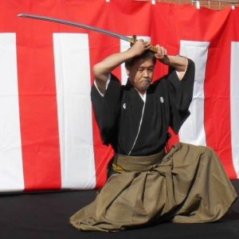

Iaijutsu

After we learned the basics (welcomes, suit, stands, sittings, defences, cuts), we learn the steps of attack and defense, form of practice (kata) from the positions of standing, - sitting, - walking; all of them are organised to schools (ryû), with the weapons bellow:

- Shinai (bamboo sword)
- Katana (samurai sword)

With katana we practice 6 ryû:

- Shinto Munen ryû tachi iai
- Rikishin ryû
- Ryugo ryû
- Keishi ryû
- Araki ryû
- Sekiguchi ryû
