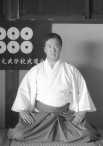
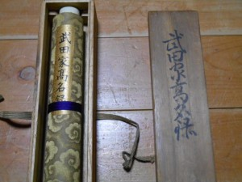

A living legend: our grandmaster Jun Osano Nihon Jûjutsu 8.dan.

Whose practicing japanese martial arts may know this words: men kyo kaiden.

In the old japanese schools wasn’t dan levels.  The  student from a few years of practicing got  shoden  (lower level) at first, and after came the chuden  (middle level).  If the student was persisdent enough,  the master wrote a MEN KYO KAIDEN roll –  certificating with this that all of the knowledge is his  own from that ryu (school), and he has the rights to  teach it by grandmaster.

Jun Osano shihan was born in 01 june 1954 in  Fujiyoshida city (Yamanashi prefecture).
He had been started practicing the martial arts, when  he was 7 years old.

He graduated int he University of Tokai on faculty of politics and economy. After this, now he teaching a senior high school in his hometown, Fujiyoshida city.

Today he has 9 men kyo kaiden roll from traditional japanese schools. In these days the style directors are give rolls like this, but only japanese master can get.

He is the president of the International Suigetsujuku Bujutsu Association (ISBA), as well as the Taiwanian gold Hawk Kung Fu Society – Japanese section, and the Japanese General Budo Laboratory.

Our master has individual knowledge in Japan with his 9 men kyo kaiden. His purpuse is to acquainting and conservationing of the historical traditions for the posterity, what he also do with his book.

Shihan Osano is the president of ISBA International Suigetsujuku Bujutsu Association. It’s a Japanese association, which purpose is to teaching the traditional schools on the world. In this school the teaching is being on more hundred years old places and methods.

## Shihan Osano's schools:

### Yagyu-Shingan ryu Heijutsu

**Characteristics**

Yagyu-shinghen ryu heijutsu has fighting way like Chinese Kung Fu. This ryu can interval and circuit training. The punch of this ryu is called „Igaguri no hitotsuki (one punch of chestnut bur)”. The skilled peoples can knock down toward strong enemy with one punch.

**Contents**

1.  OMOTE (7 article) -- shadow style training
2.  CHUGOKU (7 article) -- shadow style training
3.  OTOSHI (7 article -- shadow style training
4.  KIRI (7 article)  -- shadow style training
5.  TOPPANASHI -- TOKKAESHI (14 article)
6.  TORIDE (7 article)
7.  KOGUSOKU (7 article)
8.  KOTEGAESHI (7 article)
9.  KUGURITE (7 article)
10. SPECIAL SKILL

5 -- 10: is general jujutsu techniques

**Genealogy**

<!--1.  TAKENAGA Hayato
2.  KIKKAWA Ichirôemon
3.  ITO Kyuzaburô
4.  OYAMA Samon
5.  AIZAWA Chunoshin
6.  CHIBA Yoshisuke
7.  SATAKE Morinosuke
8.  SATô Gonzô
9.  HOSHI Teikichi yoshimori (az árnyék edzés módszer alapítója)
10. TAKAHASHI Hikokichi masayuki
11. SUZUKI Heikichi takemori
12. SAIDA Moshichi yoshinori (_másik ágon_ 12. SUZUKI Sensaku takemori)
13. ABE Mutsuo tadanori (_másik ágon_ 13. SATô Kinbé kiyoaki)
14. TAKEDA Gunko sanenori (_másik ágon_  14. NISHIGôRI Takio akimori)
15. TôYAMA Kunio kuniyoshi
16. OSANO Jun tadamori-->

|   |                | other sect     |
|--:|----------------|----------------|
|1. | TAKENAGA Hayato ||
|2. | KIKKAWA Ichirôemon ||
|3. | ITO Kyuzaburô ||
|4. | OYAMA Samon ||
|5. | AIZAWA Chunoshin ||
|6. | CHIBA Yoshisuke ||
|7. | SATAKE Morinosuke ||
|8. | SATô Gonzô ||
|9. | HOSHI Teikichi yoshimori (the originator of shadow training way) ||
|10.| TAKAHASHI Hikokichi masayuki ||
|11.| SUZUKI Heikichi takemori | &#11022;|
|12.| SAIDA Moshichi yoshinori | 12. SUZUKI Sensaku takemori |
|13.| ABE Mutsuo tadanori | 13. SATô Kinbé kiyoaki |
|14.| TAKEDA Gunko sanenori | 14. NISHIGôRI Takio akimori |
|15.| TôYAMA Kunio kuniyoshi ||
|16.| OSANO Jun tadamori | &#11168; |

### Asayama-Ichiden Ryu Jujutsu

Asayamaichiden ryu is very old Bujutsu. The original Asayamaichiden ryu had many kind of bujutsu, for example Jujutsu, Kenjutsu, Iai and Bo, etc. However, Senday Asayamaichiden ryu is the pure sect of jujutsu.
Asayamaichiden ryu jujutsu has very peculiar technique. Omote no kata has acrobatic ukemi, for example back turn and somersault. However is is easy to acquire.
The basic of all technique is „Inokamae”. This means: „The posture of consciousness”. The student of SATO Yutaka is only OSANO Jun.

**Genealogy**

1.  ASAYAMA Ichidensai (the originator)
2.  ASAYAMA Seiken
3.  MORINO Nyudô
4.  AKAYAMA Daizen
5.  ABE Kubojiro sadayoshi (the last name is Bushi or Bujutsuka name)
6.  ASAYAMA Daizen sadaichi
7.  AIZAWA Seizô naoyoshi
8.  AIZAWA Rikio and ASHIDATE Hiroshi
9.  SATO Yutaka (He is well in Miyagi pref.)
10. OSANO Jun

**Technikái**

1. OMOTE (6 article x 6 variety = 36 article)
2. URATE (12 kata)
3. CHIDORI (9 kata)
4. GOKUHI
5. HIRYU
6. MENKYO (Secret thrust and revival technique)

### Shibukawaichi Ryu Jujutsu

The technique system of Shibukawaichi ryu jujutsu is very modern style. This ryu jujutsu is of one the last traditional (Koryu) jujutsu. It is organized by fixed attack method. This ryu have many kind of defense technique. It is very orthodox and variety. This ryu have many weapon: Bô, Hanbô, Jitte and Kusarigama.

**Genealogy**

|   | Shibukawa ryu  |      |
|--:|----------------|----------------|
|1. | SHIBUKAWA Bangorô yoshimasa (1652 – 1704) |
|   | A Shibukawa ryu jujutsu első generációja |
|2. | SHIBUKAWA Tomoemon tanechika (? – 1729) |
|3. | SHIBUKAWA Bangorô sukenori (1690 – 1763) |
|4. | SHIBUKAWA Bangorô tokifusa (1720 – 1797) |
|5. | MIYAZAKI Giemon mitsuyoshi (? – 1860) |
|   | A Nanbaippo ryu jujutsu, Shibukawa ryu jujutsu és Asayama ryu hojôjutsu shihan-ja |
|6. | SHUDô Kuranoshin mitsutoki (1814 – 1898) |
|   | Az Asayama ryu bôjutsu shihan-ja. A Shibukawaichi ryu jujutsu első generációja. |

|   | Shibukawaichi ryu | másik ágon  |
|--:|----------------|----------------|
|2. | MIYATA Tomokichi Kunitsugu (1855 – 1922) |
|3. | KOZUE Shigetaro kunitoki | 3. KURUMAJI Kunimatsu masatsugu
|4. | TANITA Juichi tsugutoki | 4. UNE Shigemi tsuguaki
|5. | TANITA Asao tokinobu
|6. | OSANO Jun nobutsune | 5. OSANO Jun tokifusa

**Contents**

1. Jujutsu 231 kata
2. Sanjaku-bô (Hanbô) 10 kata
3. Jitte 3 kata
4. Fundô (Chain) 3 kata
5. Rokushaku-bô (Long staff) 10 kata

### Rikishin Ryu Bujutsu

The original Rikishin ryu have huge number of Kata. However DAICHO shihan converted from Kobudo to modern budo. So, his students is all modern budo practicer. Kobudo students is very few, and many Kata is gone. Rikishin ryu Kata is very beautiful and has refining technique.

**Genealogy**

|   |                | other sect     |
|--:|----------------|----------------|
|1. | KANBE Saga nyudô iemitsu |
|   | The shihan of Takenouchi ryu bujutsu. The first generation of Rikishin ryu. |
|2. | KANBE Hachirôzaemon fujimitsu |
|3. | ARAKAWA Hachihirô yoshimitsu |
|4. | KATAOKA Yohachirô ujimitsu |
|5. | KANBE Ippachi munemitsu |
|6. | SUGIYAMA Umenosuke katsumitsu |
|7. | ôE Yasuzaemon yoshimitsu |
|8. | ôE Wasaburô iemitsu |
|9. | DAICHO Kurô yukimitsu
|   | He is Judô, Kendô, Iai Jutsu Hanshi of Dainihon-butuku-kai. He lived in Shizuoka pref. His body is very big, like a prowrestler. (1875 – 1964) |
|10.| MIWA Katsujirô hiromitsu (Ken, Iai)
|11.| ICHIKAWA Hiroshi tômitsu | KAMATA Tadayoshi nobumitsu (Bô) |
|12.| MIWA Katsujirô hiromitsu |
|13.| OSANO Jun fujimitsu |

Az 1--9. generation shihan was born in Okayama pref.

**Contents**

1. Bô 14 kata
2. Ken (sword) 10 kata
3. Iai 5 kata

### Shintô Munen Ryu Tachiiai

Shintô munen ryu tachiiai is no sitting position. 12 Kata is all standing position. This ryu devote slanted cut method. Do not cross cut. This technique is very practical. We must be sure to training put on Montsuki kimono. This is shintô munen ryu regulation. Almost iai ryu is silent. However this iai motions take utterance (kiai).

**Genealogy**

1.    FUKUI Hyoemon yoshihara
2.    TOGASAKI Kamatarô akiyoshi
3.    OKADA Jumatsu yositoshi
4.    OKADA Jumatsu toshisada
5.    SATô Manjirô shigekata – the first generation of Hachinohe feudal domain.
6.    NAKAZATO Kôkan
7.    MAEDA Toshimi
8.    KITAMURA Masu
He is Koryu bujutsu meijin[^1] and menkyokaiden record holder. His menkyokaiden school is Hokushin ittô ryu kenjutsu, ôtsubo ryu bajutsu, Kawasaki ryu jujutsu, Anazawa ryu naginata, Shintô munen ryu tachiiai, Todaseiken ryu bôjututsu, Shijô ryu reishiki (samurai manners), Kagami ryu dakyu (japanese traditional cricket), Kôshuryu gungaku (the army strategy of old age), Mizoguchi ryu iai, Takanosu ryu hojô, Tushin ryu kenjutsu, Yagyu ryu bujutsu, Ittô ryu jujutsu.
9.   KOSEGAWA Mitsuru - Egyedül a Shintô munen ryu shihan -ja, a többi iskola elveszett.
10. OSANO Jun

[^1]: It’s a very prestigious title. In every year from 1937 organising the Meijin Championship. The player that wins four games out of seven first in the championship will become the new Meijin title holder. It’s meaning by word: „An excellent person”.

**Contents**

- 12 kata (no name)
- No. 1., No.2., No.3., ... No.12. (Japánul: Ipponme, Nipponme, Sanbonme, Yonhonme, Gohonme, Ropponme, Nanahonme, Happonme, Kyuhonme, Jupponme, Juipponme, Junihonme.)

### Anazawa Ryu Naginata

Anazawa ryu naginatas is one of the most popular naginata ryu in Edo period. Anazawa ryu naginata devote cross cut method. Slanted cut is only a few technique. The cross cut technique is very dynamic.
The second characteristic is running with short steps. It is Japanese traditional woman running way. She can’t run by long strides. Because samurai house woman put on kimono. The high of Igarashi sensei was very short. However she looks like very big, when use naginata. She is Sadô (tea ceremony) shihan too. She had many Sadô students, but naginata students is only Osano Jun.

**Genealogy**

1.  ANAZAWA Jokin
2.  UMEDA Mokunojô
3.  KOISO Kumezaemon
4.  SAKUMA Asaemon
5.  SEGAWA Senri
6.  SEGAWA Yuhon
7.  TOZAWA Yaichizaemon
8.  TOZAWA Jizaemon
9.  UEMURA Sondayu
10. TOZAWA Motumo
11. MATSUZAKA Jirôzaemon
12. ÔNUMA Midori (nő)
13. IGARASHI Kinu (nő)
14. OSANO Jun

**Contents**

15 kata:

1. Jôdan no koto
2. Chudan no koto
3. Gedan no koto
4. Hidari no koto
5. Migi no koto
6. Ryoashi no koto
7. Koshiguruma no koto
8. Momijigasane no koto
9. Hangasane no koto
10. Hagyunokaeshi no koto
11. Kazamakuri no koto
12. Ôarashi no koto
13. Koarashi no koto
14. Shishinohagami no koto
15. Tsurugifurashi no koto

### Tentô Ryu Bujutsu

Tentô ryu main bujutsu is naginata. Nowadays, Tentô ryu naginata practicer is a large number of people. Because the modern naginata school is Tentô ryu. But my (OSANO) naginata ryu is Anazawa ryu. It’s enough for me. So, I study other weapons technique of Tentô ryu.
The characteristc of technique is walking way. It use cross legs, the hit way is soft and speedy. It is the secret principles.

**Genealogy**

1.  SAITO Denkibô
2.  SAITO Hôgen
3.  SAITO Ushinosuke
4.  HINATSU Kizaemon shigetaka
5.  KAKO Rihe
6.  MURAKAMI Gonzaemon
7.  HINATSU Yasuke takatada
8.  SHIMOGAWARA Shinnai kuninaga
9.  SHIMOGAWARA Shinnai kazukuni
10. SHIMOGAWARA Shinnai kazuoki
11. SHIMOGAWARA Benzô kazuyuki
12. SHIMOGAWARA Tadaroku kazuhiro
13. SHIMOGAWARA Kiyo ikkaku
14. MITUMURA Akinori
15. MITUMURA Chiyo (woman)
16. NISHIGAKI Kin (woman)
17. ABE Toyoko (woman)
18. OSANO Jun (the last student of ABE)

(14 -- 17: Dainihon-butuku-kai shihan)

**Contents**

1. Tachi (sword) 48 kata
2. Nitô (double short sword) 16 kata
3. Tantô (mini sword) 5 kata
4. Kodachi (short sword) 3 kata
5. Jô (long stick) 10 kata
6. Kusarigama (chain-sickle) 8 kata

### Heihô Niten Ichi Ryu & Shinmen Nitô Ryu Kenjutsu

Miyamoto Musashi is one of the most famous bujutsuka. This two ryu use double swords. Niten ichi ryu kata is very slowly. The important idea of this ryu is winning with „Ki” (mental and spirit power). It is the secret principles. Shinmen nitô ryu kata is very speedy. The important idea of this school is winning with the magic technique.

**Genealogy**

|   | Niten ichi ryu   | Shinmen nitô ryu |
|--:|------------------|------------------|
|1. | MIYAMOTO Musashi genshin |
|2. | TERAO Kumanosuke noboyuki | . |
|3. | SHINMEN Bensuke noobumori | . |
|4. | MURAKAMI Heinai masao | . |
|5. | MURAKAMI Hachirôemon masayuki | . |
|6. | NODA Saburôbe tanekatsu | . |
|7. | ÔTSUKA Shohachi akihiro | unknown |
|8. | ÔTSUKA Matasuke tsunekiyo | . |
|9. | NONOMURA Hironosuke nagamasa | . |
|10.| IZUNO Junai | . |
|11.| NODA Saburôhachi tanehisha | . |
|12.| NODA Tatsusaburô tanesuke | . |
|13.| KANO Gunji | . |
|14.| TSURUTA Mitsuo |  IGARASHI Kazutaka nitôsai |
|15.| MATSUNAGA Noboyuki | . |
|16.| ARAZEKI Tomisaburô nitôsai |
|17.| OSANO Jun nitensai |

**Contents**

1. Niten Ichi Ryu – Goho no kata 5 kata
2. Shinmen nitô ryu – 23 kata

### Keishi ryu Iaijutsu

This is not a traditional ryû-ha (school), but was created 130 years ago from different masters of iaijutsu schools to teach policemen in the way of the sword. Techniques of Keishi ryû are similar to the techniques of Shinto munen ryû and therefore it is easier to learn for ISBA-members who already study Shinto munen ryû iaijutsu. All kata are standing techniques (tachiai).

Schools which from created:

- Asayama ichiden ryû
- Kyoshin meichi ryû
- Shinto munen ryû
- Tatsumi ryû
- Tamiya ryû

### Ryûgô ryu Iaijutsu

The kata of Ryûgô ryû are all sitting techniques (Seiza-waza). In Ryûgô ryu iaijutsu, there are jumping style techniques and the sword lead back technique (nôtô) is unique.

### Araki ryû Iaijutsu

This school contents difficult techniques which are performed powerful.
