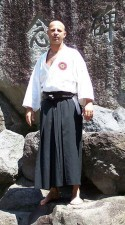

1969\. május 27-én születtem Miskolcon.

A harcművészetek megismerését Shito ryu karate gyakorlásával kezdtem 1985-ben.

1987-ben egy barátom meghívására mentem le Jûjutsu edzésre, mely egy sokkal szélesebb és színesebb kibontakozást jelentett a harcművészetek terén.

Első vizsgámat 1989-ben shihan Kelemen István, a Magyar Ju Jitsu Szövetség elnöke előtt tettem le.

1996-ban a Nemzetközi Harcművészeti Szövetség (IMAF) európai technikai igazgatója, Kurt Schöffman jelenlétében megszereztem az 1. kyu fokozatot.

Japán mesteremmel shihan Jun Osano-val 2005-ben ismerkedtem meg, aki meghívott a következő évben Japánban megrendezésre kerülő szemináriumára, ahol megszereztem Nihon Jûjutsu 1. dan fokozatomat.

A pusztakezes katák mellett az eszközös (kobudo) és szamuráj kard (katana) katákat is elkezdtem gyakorolni.

2009\. év nyarán Berlinben, újra Osano shihan előtt vizsgáztam Nihon Jûjutsu 3. dan, Iaijutsu 1. dan fokozatra, mellyel együtt a Nihon Jûjutsu oktatására feljogosító shihan minősítést is megkaptam.

Még ez év szeptemberében saját dojo-t nyitottam Budapesten.

2010\. az Osano shihan vezette fehérgyarmati szemináriumon levizsgáztam Iaijutsu 2. dan fokozatra is.

A következő mérföldkő a 2013. évi Budapesten megrendezett első magyarországi nemzetközi ISBA szeminárium, ahol Osano shihan előtt Nihon Jûjutsu 4. dan -  fokozatra vizsgázhattam.

2014\. júliusában tanítványaimmal részt vettünk a Kronachban (Németország) megrendezett nemzetközi szemináriumon, ahol sikeresen levizsgáztam Iaijutsu  3. dan fokozatra. Így már nem csak a tradicionális jûjutsu katákat oktathatom, hanem a szamurájkard művészetét is.

2016\. júliusában ismét lehetőséget kaptunk a nemzetközi szeminárium megrendezésére Budapesten, ahol japán mesterünk előtt az ISBA által előírt vizsga követelményeit teljesítve Nihon Jûjutsu 5. dan fokozat tulajdonosa lehetek.

2017\. júliusában a Shihan meghívásának eleget téve szemináriumon vettünk részt Japánban, ahol shihan Jun Osano a megtisztelő Jujutsu - Menkyo tekercsek Shoden, -Chuden fokozatát adományozta nekem, elismerve ezzel fejlődésemet.

2018\. évben európai körútja egyik állomásaként Budapestre is ellátogatott Osano Shihan, Iaijutsu és Kenjutsu szemináriumot tartott, melynek záró eseményeként Iaijutsu mokuroku tekercset adományozott nekem, ezzel a tekercsel igazolta, hogy az Iaijutsu (7 db ryu) iskoláit is elsajátítottam.

2018\. decemberében Iaijutsu 4. dan fokozat, Kobudo 3. dan fokozat elismerést kaptam a Budapesten megrendezett nemzetközi szeminárium keretein belül Jun Osano Shihantól.

2019\. évben Budapesten megrendezett nyári szeminárium záró ünnepségén Jujutsu 6. dan fokozatot, Tanbo mokuroku tekercset vehettem át.

Ezen tekercsek tulajdonosaként (Magyarországon egyedüliként) shihan Jun Osano  a tradicionális japán harcművészet (Jujutsu, Iaijutsu, Tanbo) tanulását befejezettnek ismeri el,  küldetésem az edzéseken való oktatás és a gyakorlás lett.
