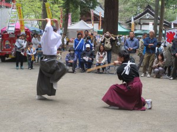

A 2 × 5 kata-ból (formagyakorlat) álló ryû-k (iskola) elsajátítása során boken-nel (fakard) páros gyakorlatokat végzünk.

- Tachi dori (pusztakézzel fakard ellen)
- Kumi uchi (fakarddal fakard ellen)
- Rikishin ryû Kenjutsu (fakarddal fakard ellen)
- Ryu ko ryu Kenjutsu (fakarddal fakard ellen)
