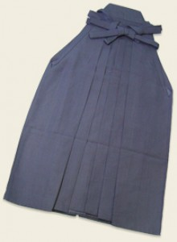

A hakamát tradicionálisan a szamurájok viselték, sok japán harcművészetben ma a formaruha része. A gi, amit karatéban, aikidoban, vagy judoban ma viselnek, a régi ruházat alsórésze volt.
Eredetileg a hakamát a nadrág fölött viselték, a célja pedig az volt, hogy megvédje a lovast az ágak és egyéb növények okozta sérülésektől. Miután japánban a lovas hadviselés egyre inkább átadta a helyét a gyalogos hadseregnek, a szamurájok tovább viselték a hakamájukat, mert ez megkülönböztette, és könnyen felismerhetővé tette őket.

A hakama a régi időkben nem volt olcsó mulatság. Annak ellenére, hogy a dojokban kötelező volt a hakama viselete sok tanuló nem engedhette meg magának, hogy hakamát vegyen. Ha egy tanuló nem tudott venni, és egy idősebb rokonától sem kapott, akkor egy futon (japán takaró) huzatát szedte le, amit befestettek, és abból varratott hakamát magának. Az így készült hakama nagyon olcsó volt, de ugyanakkor nagyon vékony is. Gyakran előfordult, hogy a folytonos használat miatt a futon huzatának eredeti színes és változatos mintái elkezdtek átütni az új festésen, vagy a külső anyag gyors kopása miatt kilógott a bélés.

A régi hakamaviselet sohasem egyszínű volt. A legszínesebbet a nemesi származásúak viselték, de az egyszerű hakamákra is mindig varrtak valamilyen mintát. Az alapszín is változott az évszaktól és alkalomtól függően.
A legtöbb mai harcművészeti iskolában a hakamát csak a feketeövesek viselhetik. Ennek ellenére a nőknek sok helyen megengedik a hakama viseletét kezdő koruktól fogva. Ez azért van így, mert a gi eredetileg csak alsóruha volt, és a nők iránti tisztelet v.mint udvariasság megköveteli, hogy viselhessék a teljes ruházatot, és ne kelljen „alsóneműben” mutatkozniuk nyilvánosan.

A hakamának hagyományosan 7 hajtása van (5 elöl, 2 hátul) és mindegyiknek szimbolikus jelentése van:

- Yuki – bátorság, hősiesség
- Jin – emberiesség, jószívűség
- Gi – igazságosság
- Rei – erkölcs, alázat
- Makoto – becsületesség, igazmondás
- Chugi – hűség, elhivatottság
- Meiyo – becsület

