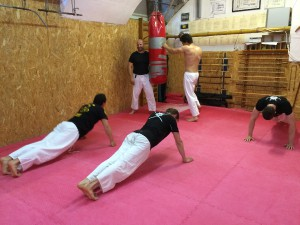

- punches, kicks and escapes from different grabs (eg. choking, hugging, etc), learning simple take downs with imaginable enemies at first, then with our training partner
- we learn how to fall "well", without any injuries
- the technics what we learnt smoothing towards with situational practice, until these will come from reflex
- besides the useful technics we increase our physical power to being more fit and confident
- the self defence is built to Nihon Jujutsu Japanese martial art, which is several hundred years old but not outdated at all
- during the trainings we also develop our self-confident - in a possible attack we have to defence ourselves and use what we learnt.
