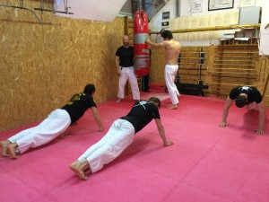

- ütések, rúgások, v.mint különböző fogásokból (pl.: fojtás, átkarolás, stb.) való szabadulások, ill. egyszerű földre vitelek megtanulása elképzelt ellenféllel, majd a későbbiek folyamán páros gyakorlatok által
- megtanuljuk, hogyan kell „jól” esni, hogy sérülés nélkül megússzuk az eséseket
- a megtanult technikákat szituációs gyakorlatokkal csiszoljuk tovább, egészen addig, míg reflex-szerűvé nem válnak
- a hasznos technikák mellett az erőnlétet is növeljük, hogy fittebbek és magabiztosabbak legyünk
- az önvédelem a Nihon Jûjutsu japán harcművészetre épül, ami egy több száz éves, ám mégsem idejét múlt rendszer, mind a mai napig megállja a helyét a világban
- az edzések során önbizalmunkat is erősítjük, hogy egy valós támadás során se blokkoljunk le, hanem tudjuk alkalmazni a tanultakat és merjünk kiállni magunkért.
